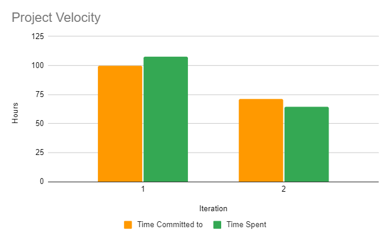

# Revision Revision
----

Also, as a team, complete a retrospective activity based on your work from the previous iteration: discuss a part of your project that has not been as successful as you would have liked, and how it can be improved in this iteration (do this early!). Determine concrete (and realistic) ways of improvement, and decide how its success will be evaluated at the end of the iteration (measurable and objective). Also include a chart (as an image) showing the 2 data points of project velocity from the last two iterations. Submit with this iteration a short (500 word written) description of what you have discussed, as a file called RETROSPECTIVE.md in your git repository.

----

&emsp;To start this retrospective, we would like to reflect upon a few things. We feel that our project has been a great success, and it was difficult to reflect look back upon the previous iterations and feel anything but amazed by how, from very little collective experience in android studio, we have made a full application. With our steadfast branching strategy and thorough testing, we never had a broken develop branch. Upon each iteration, our app functioned as a stand-alone product, even in the first iteration. Despite this, we did come up with some issues that we would have liked to solve.

&emsp;Our unit testing was through and helpful because of it. But, because of a lack of foresight, the tests each created objects using constructors in the beginning of each individual test, instead of using the beforeEach function built in. This posed a particular inconvenience any time we went to consider changing constructors. 
The solution for our unit test based technical debt is refactoring. We could refactor the unit tests to pull out the constructors into a beforeEach method, but with this iteration being as far along as it is, it would not make sense for us to pay off this debt. Given our code for this iteration is done, and a change to the constructors is not planned before the end of the iteration, to pay off the debt would save us no time in the future. As such, we do not plan to change this shortcoming.

&emsp;Our team likes stylish things, we had a vision for the aesthetics of the app. Unfortunately, because of the time frame we had for each iteration, we could not fit in as much time on styling the app as we would have liked. Given we had more time, we would have liked to better learn the styling options available to us through android studio, and we would have loved to create our own custom assets to have a more consistent feel to our app than it has now. How we could have had more time directly relates to the next point. This point as well, we do not plan to address in this iteration, as it does not have a major impact on the application's function.

&emsp;Technical debt: we did not have much of it. A somewhat counterintuitive point to make, shouldn’t every team strive to get out of a project without leaving behind any technical debt? It is more complicated than it seems. Given our situation of being in a four-month term, our conditions for development are notably different from that of a professional environment. We, for one, do not support our app once the final iteration is done, and, for a second, we do not spend our full work week working on this application. It is because of these differences that we believe we could have been less prudent in our technical debt strategy. If we were to move faster and make more technical debt along the way, in many cases, the debt we made we would never need to pay off in exchange for faster short-term feature implementation. And, as the last paragraph indicated, we could have used the extra time to add more visual appeal to our app. Unfortunately, this is an issue that cannot be fixed, and so we will finish this iteration without having the extra time we could have gained by being less prudent.

&emsp;Our application development went so smoothly as to never have an issue that rendered the app so much as unpleasant. It is because of this that we do not plan to make any large changes to anything that was left unfinished in any previous iteration, mostly because there is nothing we did not see though to completion in a single iteration.

---

